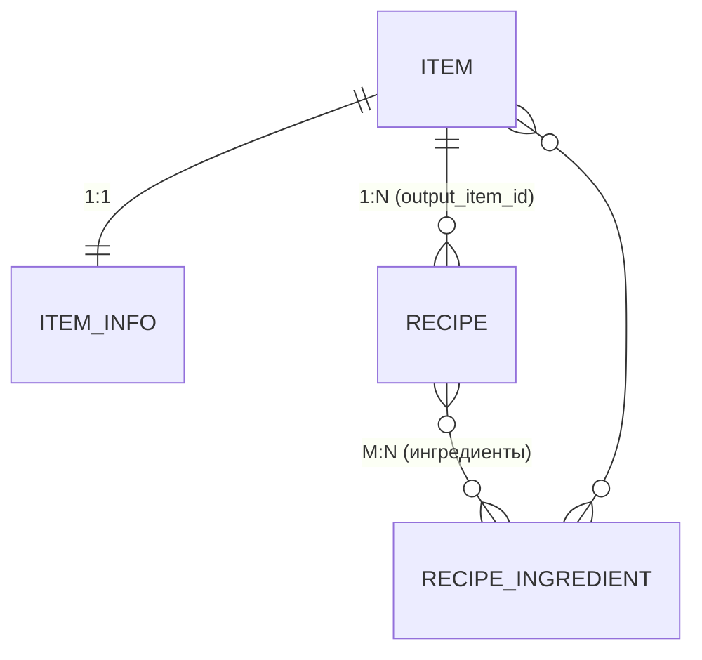

```mermaid
erDiagram
    ITEM ||--|| ITEM_INFO : "1:1"
    ITEM ||--o{ RECIPE : "1:N (output_item_id)"
    RECIPE }o--o{ RECIPE_INGREDIENT : "M:N (ингредиенты)"
    ITEM   }o--o{ RECIPE_INGREDIENT : ""
```